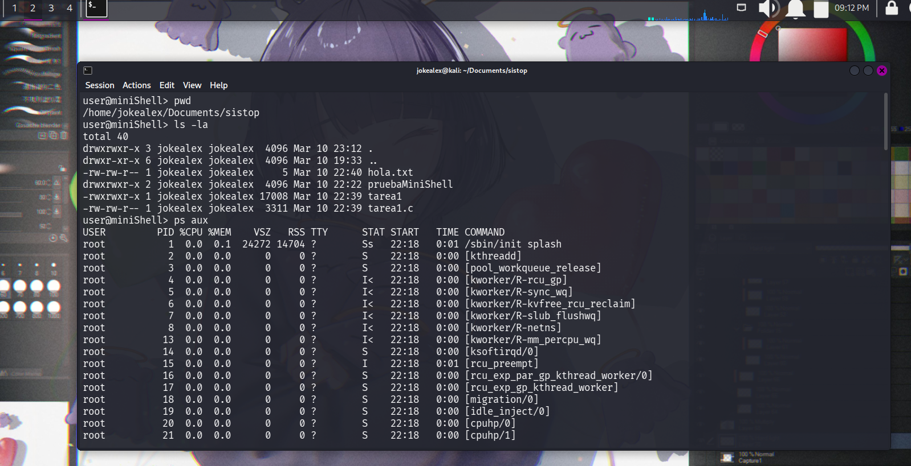
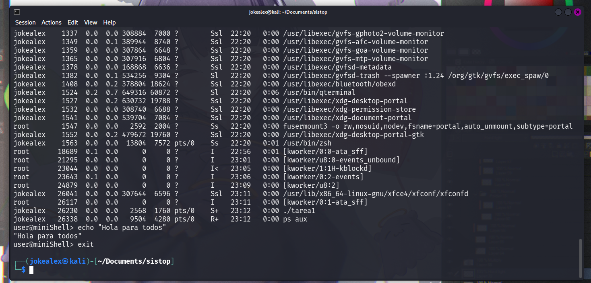

# Tarea 1: Implementación de un intérprete de comandos mínimo (minishell)

	Tarea planteada: 2026.03.03
	Entrega: 2026.03.10

**Alumnos**: Monroy Tapia Jesús Alejandro
		 Ponce de León Reyes Bruno

## **Objetivo**

Implementar un intérprete de comandos básico (shell) que permita al usuario
ejecutar programas del sistema, manejando correctamente la creación de
procesos mediante `fork()`, la ejecución de programas con `exec()` y la
recolección de procesos hijos con señales (`SIGCHLD`).

---

## Instrucciones de ejecución y uso basico

Para ejecutar la minishell desarrollado en lenguaje C es necesario contar con el compilador gcc para poder crear el archivo ejecutable de esta tarea, como se muestra a continuacion.

```bash
gcc miniShell.c -o miniShell
```

Ya al compilar lo siguiente que hay que hacer es ejecutar el archivo compilado, que es el ejecutable que lanzara nuestra miniShell esto lo podemos hacer de la siguiente forma

```bash
./miniShell
```

Al ejecutar debera salir el siguiente prompt en pantalla que indicara que es el programa esta en ejecucion y que es una shell diferente a la que la terminal esta manejando por defecto:

```bash
user@miniShell>
```

En caso de querer salir de la miniShell ejecutar la instruccion **exit**

```bash
user@miniShell> exit
```

---

## Explicación del diseño

Para la elaboración de esta miniShell se utilizo el lenguaje de programación C, debido a que este lenguaje esta fuertemente relacionado con el kernel de Linux y sus funciones como *fork()*, *exec()*, *execvp()* y *sigaction*. Son más eficientes al utilizarlas en lenguaje C, además de que las bibliotecas de C están mejor optimizadas para manejar todas estás funciones de forma nativa y en bajo nivel, como lo es la biblioteca **<unistd.h>**.

Para el desarrollo de esta práctica se utilizaron las siguientes bibliotecas de lenguaje C para la eficiencia del programa.

**unistd.h**: Define la interfaz con el sistema operativo POSIX, en este caso para utilizar las funciones *fork*, *execvp* y *pid_t*

**sys/wait.h**: Se encarga de la sincronización entre procesos, de esta bibliotecas utilizamos la funcion *waitpid*

**signal.h**: Se encarga de controlar eventos asincronos, como el sucede de CTRL + C, de esta biblioteca utilizamos las funciones *SIGCHLD*, *SIGINT* y la estructura de *sigaction* 

**errno.h**: Se encarga de manejar los errores, de esta biblioteca solo utilizamos la variable *errno*

Para el funcionamiento de esta minishell se explica como se implementaron las diferentes funciones empleadas en este programa de minishell.

- **manejar_sigchld():** Esta función se encarga del manejo y limpieza de los procesos hijos. Cada vez que un proceso hijo termina, debe ser limpiado para evitar procesos "zombie".

- **config_signals():** La función se utiliza como una configuración inicial para preparar a la minishell para las señales que pueden ocurrir durante su ejecución. Con el uso de la estructura sigaction se crearon sa_chld y sa_int, con los cuales se pueden gestionar eventos asíncronos y sin que se interrumpa la shell.

- **ejecutar_comando():** Se manda a llamar esta función cada vez que el usuario inserta comandos en la minishell. Dentro de esta función se utiliza fork() para crear un proceso hijo, mientras que execvp() se emplea para reemplazar la memoria de dicho proceso con el nuevo programa.

---

## Ejemplo de ejecución

A continuación se muestran capturas de pantalla del programa de minishell en ejecución en entorno POSIX como lo es Kali Linux, en este caso siendo utilizado desde una máquina virtual.

Como podemos ver comandos básicos como **pwd**, **ls -la** y **ps aux**, funcionan correctamente y devolviendo la información que debería de ser de acuerdo a su ejecución, esto nos comprueba que nuestro programa funciona correctamente y que no tiene problemas al manejar estas instrucciones.



A continuación podemos ver como la instruccion de **echo** es capaz de imprimir un mensaje en pantalla, así como el comando de **exit** termina la ejecución del miniShell



---

## Dificultades encontradas

**Documentación de procesos en C.**

Una de las barreras principales durante el desarrollo fue la curva de aprendizaje necesaria para interpretar la documentación oficial de las llamadas al sistema. A diferencia de las bibliotecas de alto nivel en lenguajes como Python, la documentación en C (accesible mediante el comando **man**) requiere un entendimiento profundo del manejo de memoria y de los estados del procesador.

Algo que fue difícil para los dos ya que tenía tiempo que no realizamos trabajos en lenguaje C, pero por esto mismo fue un buen trabajo de investigación ya que pudimos darnos cuenta que muchos errores que teníamos lo tuvieron personas anteriores por lo que hicimos uso de la plataforma de StackOverflow para revisar código de procesos.

**La acción con CTRL+C**

La dificultad de manejar CTRL+C reside en la contradiccion de roles, el proceso padre debe ser inmune a la interrupción para mantener la persistencia de la minishell, mientras que los hijos debe mantener esta sensibilidad nativa a la señal para permitir el control ejecución por parte del usuario. Esto obliga a realizar una reconfiguración de la máscara de señales en el contexto del hijo antes de la sustitución de la imagen del proceso con el **execvp**

### Referencias utilizadas

[How to handle Control-C signal while designing a shell? - Stack Overflow](https://stackoverflow.com/questions/57480852/how-to-handle-control-c-signal-while-designing-a-shell)
[linux - Writing a simple shell in C using fork/execvp - Stack Overflow](https://stackoverflow.com/questions/28502305/writing-a-simple-shell-in-c-using-fork-execvp)
[fork(2) - Linux manual page](https://man7.org/linux/man-pages/man2/fork.2.html)
[exec(3) - Linux manual page](https://man7.org/linux/man-pages/man3/exec.3.html)
[sigaction(2) - Linux manual page](https://man7.org/linux/man-pages/man2/sigaction.2.html)
[wait](https://pubs.opengroup.org/onlinepubs/009695299/functions/waitpid.html)
