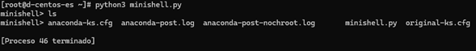
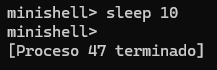
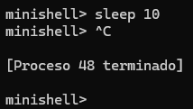
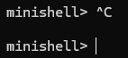
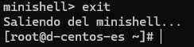

# Minishell - Intérprete de Comandos Básico

## Descripción

Este proyecto consiste en la implementación de un **intérprete de comandos básico (minishell)** que permite ejecutar programas del sistema en un entorno Unix/Linux.

El minishell permite al usuario ingresar comandos desde la terminal y ejecutarlos mediante la creación de procesos hijos utilizando la llamada al sistema `fork()`. Posteriormente, el proceso hijo reemplaza su imagen con el programa solicitado mediante `execvp()`.

El programa también maneja correctamente señales del sistema como **SIGCHLD** para recolectar procesos hijos terminados y **SIGINT** para permitir que los procesos hijos puedan ser interrumpidos con `Ctrl+C` sin terminar el shell principal.

---

## Requisitos

Para ejecutar este programa se requiere:

* Sistema operativo **Unix/Linux**
* **Python 3**
* Terminal de comandos

En este proyecto se utilizó **Docker con CentOS Stream 9** para ejecutar el programa.

---

## Ejecución del programa

Para ejecutar el minishell:

```bash
python3 minishell.py
```

Al iniciar el programa se mostrará el prompt:

```
minishell>
```

Desde este punto el usuario puede ejecutar comandos del sistema.

---

## Funcionamiento

El minishell funciona de la siguiente manera:

1. El shell muestra un **prompt** esperando un comando del usuario.
2. El comando ingresado se separa en programa y argumentos.
3. Se crea un **proceso hijo** mediante `fork()`.
4. El proceso hijo ejecuta el programa solicitado mediante `execvp()`.
5. El proceso padre continúa ejecutándose como intérprete de comandos.
6. Cuando el proceso hijo termina, el sistema envía la señal **SIGCHLD**.
7. El manejador de señales utiliza `waitpid()` con la opción `WNOHANG` para recolectar el proceso terminado.

Esto evita la generación de **procesos zombie** y permite que el shell continúe funcionando correctamente.

---

## Manejo de señales

El minishell maneja dos señales importantes:

### SIGCHLD

Se utiliza para detectar cuando un proceso hijo termina su ejecución.
El shell utiliza `waitpid()` para recolectar estos procesos sin bloquear la ejecución.

### SIGINT

El shell ignora la señal `SIGINT` (generada por `Ctrl+C`) para evitar que el intérprete se cierre.
Sin embargo, los procesos hijos restauran el comportamiento por defecto de esta señal, permitiendo que puedan ser interrumpidos por el usuario.

---

## Capturas de compilación/ejecución

### Compilación de minishell



### Ejecución de sleep 10



Esto demuestra que el padre sigue disponible mientras el proceso hijo se ejecuta.

### Comando ctrl + c con proceso hijo



Se demuestra que sí funciona ctrl + c mientras se esta ejecutando el hijo.

### Comando ctrl + c en minishell



Se demuestra que ctrl + c no funciona si lo ejecutas en proceso padre.

### Comando exit



---

## Dificultades encontradas

Durante el desarrollo del proyecto se presentaron algunos retos relacionados con el manejo de señales y la comprensión del funcionamiento de los procesos en sistemas Unix.

En particular, fue necesario comprender cómo `fork()` crea procesos hijos independientes y cómo `execvp()` reemplaza la imagen del proceso hijo con el programa solicitado.

También fue necesario implementar correctamente el manejo de la señal `SIGCHLD` para evitar la generación de procesos zombie.

---

## Autores

Edgar Sotomayor y Jorge Terán
